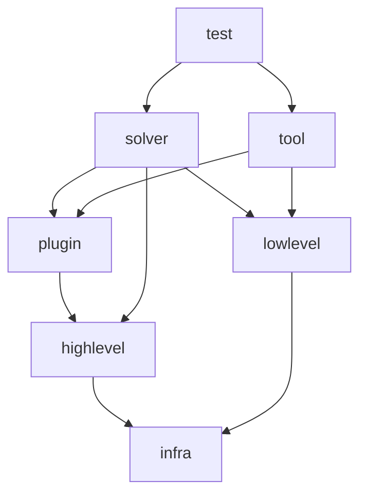

# guardian - The border guardian for your package dependencies

- [Introduction - How to keep your Haskell monorepo sane](#introduction---how-to-keep-your-haskell-monorepo-sane)
  + [Dependency Inversion Principle](#dependency-inversion-principle)
  + [The emergence of Guardian - package dependency domain isolation in practice](#the-emergence-of-guardian---package-dependency-domain-isolation-in-practice)
  + [Summary](#summary)
- [Installation](#installation)
- [Usage](#usage)
  + [Actual validation logic](#actual-validation-logic)
  + [Syntax of `dependency-domains.yaml`](#syntax-of-dependency-domainsyaml)
    - [Domain Definition](#domain-definition)
    - [Component Section](#component-section)
    - [Cabal specific settings](#cabal-specific-settings)
    - [Stack specific settings](#stack-specific-settings)
    - [Example Configuration](#example-configuration)
- [GitHub Actions](#github-actions)
- [Contribution](#contribution)
- [Copyright](#copyright)

## Introduction - How to keep your Haskell monorepo sane

Maintaining a large monorepo consisting of dozens of Haskell packages is not easy.
Sometimes, just making sure all packages compile on CI is not enough - to accelerate the development cycle, it is crucial to ensure that changes to the codebase trigger only necessary rebuilds as far as possible.

But enforcing this requirement by hand is not easy.
To make things work, a kind of people known as programmers - especially Haskellers, you know - are inherently lazy.
They are so lazy to grep through the project, shouting out "look, there is what we want!", and adding extra dependency - finally they make everything depend on each other and constitute the gigantic net of dependencies that takes a quarter day even if only a small portion of the code was changed.

Indeed, this was exactly the situation we developers at DeepFlow faced in 2021.
Our main product is a high-performance numeric solver[^1], consisting of ~70 Haskell packages, which sums up to ~150k lines of code.
It includes:

- abstraction of numeric computation backend,
- its concrete implemenatations,
- abstraction of plugins to extend solvers,
- its concrete implementations,
- abstraction of equation system,
- its concrete implementations,
- abstraction of communication strategies,
- its concrete implementations (e.g. MPI, standalone),
- abstract solver logic, and
- concrete solver implementations putting these all together.

What we had in 2021 was the chaotic melting pot of these players.
If one changes a single line of a backend, it forces seemingly unrelated plugins to be recompiled.
If one removes a single redundant instance, then it miraculously triggers the rebuild in some concrete implementation of some specialised solver.
In any case, it took at most six hours and ~100 GiB to complete, as we make heavy use of type-level hackery and rely on the aggressive optimisation mechanism of GHC[^2].

This situation is far from optimal, sacrifices developer experience, and severely slows down the iteration speed.
Our product seems dying slowly but surely.

[^1]: For those who are curious, please read our [old slide][old slide] - it is an old presentation, so some details are outdated, but the overall situation is not so different.
[^2]: The situation, however, gets better as newer GHC releases came out and we refactor the code structure.
Nowadays, it takes at most two and a half hours and only ~20GiB.
The detail of such change is out of the scope of this article.

### Dependency Inversion Principle

In the middle of 2021, we decided to fight against this situation to save our project.
Our rule of thumb here was _Dependency Inversion Principle_ from the realm of OOP.
That says:

> 1. High-level modules should not import anything from low-level modules. Both should depend on abstractions
> 2. Abstractions should not depend on details. Details (concrete implementations) should depend on abstractions.
>
> (_excerpt from [Wikipedia][dip]; renumbering is due to the author_)

This is called dependency _inversion_ because it seems inverse to the traditional usage of inheritance in OOP.
We decided to apply this principle to package dependencies.

We divided the packages into several groups, called _dependency domains_.
We drew the term and intuition from the [blog post by GitHub about partitioning databases into domains][gh-db-doms].

Our packages are divided into the following groups[^3]:

- `infra`: providing common infrastructure, such as data containers and algorithms.
- `highlevel`: high-level abstractions of backends, equations, and plugins.
- `lowlevel`: low-level and concrete implementations.
- `plugin`: concrete plugin implementations
- `solver`: concrete solver implementations.
- `tool`: misc utility apps independent of solvers.
- `test`: test packages, mainly providing cross-package integration tests.

Any package in monorepo must be classified into exactly one dependency domain.
Furthermore, we define constraints on the dependencies between domains: each domain is given the set of domains on which its members can (transitively) depend, and the induced dependency graph must form a directed acyclic graph.

The example is as follows:



Each package of a domain can depend only on the packages in the same or downstream package in the diagram.
Note that, in this setting, high-level (or abstract) packages can only depend on another abstraction or infrastructure package and only the application packages (say, `solver` and `tool) can depend both on abstractions and implementations.

[dip]: https://en.wikipedia.org/wiki/Dependency_inversion_principle
[old slide]: https://speakerdeck.com/konn/da-gui-mo-shu-zhi-ji-suan-wozhi-eru-haskell-nil-nil-pragmatic-haskell-in-large-scale-numerical-computation-nil-nil
[gh-db-doms]: https://github.blog/2021-09-27-partitioning-githubs-relational-databases-scale/
[^3]: These are not exactly what we have in reality but in simplified form.

### The emergence of Guardian - package dependency domain isolation in practice

So far, so good.
Now that we have the grand picture of the package dependency hierarchy, it is time to make things laid out.

The problem is: enforcing such an invariant by hand is almost impossible as the number of packages gets larger and larger.
Even after we sorted out where the violation occurred, it takes much time to fix them all up while continuing to add new features and fix bugs.
Furthermore, even if we had worked out things once somehow, our laziness could strike back to slowly violate such constraints and make everything rotten again. Uh-oh.

... Not really. Here, our brave `guardian` can help us!

`Guardian` is a tool designed for this purpose and developed in DeepFlow. We are running `guardian` on our CI for almost two years.

In guardian, we declare the whole dependency constraints in `dependency-domains.yaml`.
The above constraints are expressed as follows:

```yaml
domains:
  infra: 
    depends_on: []
    packages:
    - algorithms
    - geometry
    - linalgs
  highlevel: 
    packages:
    - numeric-backends
    - plugin-base
    - equation-class
    depends_on: [infra]
  lowlevel:
    packages:
    - reference-backend
    - fast-backend
    - mesh-format
    depends_on: [infra]
  plugin:
    packages:
    - plugin-A
    - plugin-B
    depends_on: [highlevel]
  solver:
    packages:
    - solver-standalone
    - solver-parallel
    depends_on: [plugin, lowlevel, highlevel]
  tool:
    packages:
    - post
    - pre
    depends_on: [plugin, lowlevel]
  test:
    packages:
    - integration-tests
    - regression-tests
    depends_on: [solver, tool]

# We track dependencies in test & benchmark components as well.
components:
  tests: true
  benchmarks: false
```

Note that we don't have to include `highlevel` into the dependencies of `solver` - it is already introduced via dependency on `plugin`.
Here, we include `highlevel` just for documentation.

Actually, this is not the first rule we had.
As mentioned above, our codebase consists of ~70 packages summing up to ~150k lines of code.
In some cases, it takes much effort to remove dependency violating the dependency domain boundary without sacrificing performance.

To accommodate such cases, `guradian` provides _exception rules_ for compromise.
It looks like this[^4]:

```yaml
...
  plugin:
    packages:
    - package: plugin-A
      exception:
        depends_on:
        - lowlevel
        - package: fast-backend
    - plugin-B
    depends_on: [highlevel]
...
```

As shown above, exception rules are specified per-package manner.
It can allow dependencies to other dependency domains and/or individual package which is otherwise banned.
An exception rule doesn't affect the transitive dependency - only the dependencies of the specified package are exempted.
In the above example, only `plugin-A` is allowed to depend on the exempted targets.
So, if `plugin-B` depends on `plugin-A`, it cannot depend on `fast-backend` package explicitly.

The point is that exception rules must be considered as tentative compromises - they must be removed at some points to enforce dependency inversion at the package level to keep the entire project healthy.
To make it clear, `guardian` will emit warnings when the exception rules are used:

```log
[info] Using configuration: dependency-domains.yaml
[info] Checking dependency of /path/to/project/" with backend Cabal
[warn] ------------------------------
[warn] * Following exceptional rules are used:
[warn]     - "A2" depends on: PackageDep "B1"
[info] ------------------------------
[info] All dependency boundary is good, with some additional warning.
```

And when the situation allows some rules to be lifted, it also tells us as follows:

```log
[warn] * 1 redundant exceptional dependency(s) found:
[warn]     - "A2" doesn't depends on: PackageDep "B1"
```

So, what `guardian` would do is:

- Check if all the packages are disjointly classified into dependency domains.
- Makes sure that the dependency graph between each domain forms a DAG.
- Check if all the dependency constraint is met, except for prescribed exceptions.
- Report the validation results with information about used/redundant exception rules.

One thing to note is that `guardian` checks dependency constraints based solely on the dependencies specified in `*.cabal` and/or `package.yaml` file.
In other words, guardian doesn't treat a dependency introduced by module imports.
This is because such a dependency is already handled by the compiler.

In our case, we had two exception rules enabled at first and it took almost half a year to finally abolish all of the exception rules.
This was finally done when the major rework on the entire structure of our product.
Indeed, one of the motivations of the refactoring was to completely deprecate the exception rules and the overall dependency graph above was the driving force to make out the correct design of the entire package structure.
In this way, the presence of exception rules in the dependency boundary constraints signals the design flaw in the package hierarchy and gives us a useful guideline for a redesign.

The benefit of dependency constraint enforcement by guardian is not limited to refactoring.
Running `guardian` on CI, one can always check the sanity of the entire structure when adding new features/packages to the monorepo.
When one adds new packages to the monorepo, guardian force us to think in which domain to put them.
If we accidentally add package dependencies violating constraints in the midway of adding new features, guardian will tell us it generously.
In this way, guardian helps the product evolve healthily while preventing getting rotten.

[^4]: As package `fast-backend` is already included in `lowlevel` domain, we don't have to include `fast-backend` as a separate exception rule. Here, we included it for the exposition.

### Summary

With guardian, you can:

- divide monorepo packages into disjoint groups called _dependency domains_,
- define the topology of DAG of dependency domains to secure dependency boundaries,
- you can still specify exception rules for compromise - they will be warned so that you can finally remove it.

Equipped with these features, we can:

- Keep the package hierarchy of the monorepo clean and loose-coupled.
- Be more careful when adding new packages/features as guardian shouts at us when violations are found.

There are several possibilities in the design of actual DAG of domains, we recommend the following rules:

- Separate abstractions and concrete implementations as far as possible.
  + Ideally, applications and/or tests can depend on both.
  + Keep DIP in mind: Abstractions SHOULD NOT depend on implementations. Implementation should depend on abstractions.
- Refine domains based on semantics/purposes.
- Use dependency domain constraints as a guideline for the design of the overall monorepo.
  + It guides us in making out the "correct" place to put new packages/features.
  + The number of exception rules indicates the code smell.

## Installation

You can download prebuilt binaries for macOS and Linux from [Release](https://github.com/deepflowinc/guardian/releases/latest).

You can also use [GitHub Action](#github-actions) in your CI.

To build from source, we recommend using `cabal-install >= 3.8`:

```sh
git clone git@github.com/deepflowinc/guardian.git
cd guardian
cabal install
```

## Usage

```sh
guardian (auto|stack|cabal) [-c|--config PATH] [DIR]
```

Subcommand `auto`, `stack`, `cabal` specifies the _adapter_, i.e. build-system, to compute dependency.

- `stack`: uses Stack (>= 2.9) as an adapter.
- `cabal`: uses cabal-install (>= 3.8) as an adapter.
- `auto`: determines adapter based on the directory contents and guardian configuration.
  + If exactly one of `cabal.project` or `stack.yaml` is found, use the corresponding build system as an adapter.
  + If exactly one of the custom config sections (say, `cabal:` or `stack:`) is found in the config file, use the corresponding build system.

Note that `guardian` links directly to `stack` and `cabal-install`, so you don't need those binaries.
Make sure the project configuration is compatible with the above version constraint.

Optional argument `DIR` specifies the project root directory to check. If omitted, the current working directory is used.

The option `--config` (or `-c` for short) specifies the path of the guardian configuration file relative to the project root.
If omitted, `dependency-domains.yaml` is used.

### Actual validation logic

When invoked, guardian will check in these steps:

1. Defines a dependency graph based on the package dependencies.
2. Checks if the graph forms DAG.
3. Checks if the dependency domain constraints are satisfied first ignoring exception rules.
4. If violating dependency is detected, exempt it if it is covered by any exception rule.
     + If any exception rule can be used, warn of its use; otherwise, report it as an error.
5. Report results, warning about used and redundant exception rules.

### Syntax of `dependency-domains.yaml`

Guardian configuration file consists of the following top-level sections:

| Section   | Description |
| --------- | ----------- |
| `domains` | **Required**. Definition of Dependency Domains (see [Domain Definition](#domain-definition)) |
| `components` | _Optional_. Configuration whether track test/benchmark dependencies as well (see [Component Section](#component-section)) |
| `cabal` | _Optional_. Cabal-specific configurations. (see [Cabal specific settings](#cabal-specific-settings)) |
| `stack` | _Optional_. Stack-specific configurations. (see [stack specific settings](#stack-specific-settings)) |

The ordering of sections is irrelevant.

See [Example Configuration](#example-configuration) for a complete example.

#### Domain Definition

Dependency domains, their members, and constraints are specified in the `domains` section.

The `domains` section must be a dictionary associating each domain label to the domain definition.
A domain label must match `/[A-Za-z0-9-_]+/`.

Individual domain definition object has the following fields:

| Field | Type | Description |
| ----- | ---- | ----------- |
| `depends_on`  | `[String]` | **Required**. Labels of the other domains that the dependency being defined is depending on. |
| `packages` | `Package` | **Required**. A list of packages of the domain. Each package can be a string or object; see below for detail |
| `description` | `Maybe String` | _Optional_. A human-readable description of the domain. Note that this field is not processed by guardian. |

Package entry occurring in the `packages` field can either be a string or package object.
A single string, e.g. `mypackage` is interpreted as a package object with only the `package` field specified, e.g. `{package: "mypackage"}`.
Package object has the following field:

| Field     | Type     | Description |
| --------- | -------- | ----------- |
| `package` | `String` | **Required**. Package name |
| `exception` | `ExceptionRule` | _Optional_. Package-specific exception rules |

Exception rule object is an object of form `{depends_on: <an array of ExceptionItem's>]}`.
Exception item can be either a simple string or an object of form `{package: "package-name"}`.
A single string as an exception rule is interpreted as a dependency on the domain with having the string itself as the label.
An object `{package: "package-name"}` is interpreted as a dependency on the package `package-name`.

Example:

```yaml
domains:
  A: 
    depends_on: [C]
    packages: 
    - A1
    - package: A2
      exception: {depends_on: [package: B1]}
  B: 
    packages: [B1]
    depends_on: [C]
  C: 
    packages: [C]
    depends_on: []
```

In the above example, packages are divided into three domains: `A`, `B`, and `C`.
Apart from the packages in the same domain, packages in domains `A` and `B` can depend on those in `C`.
Exception rule is specified for package `A2` in domain `A`, which allows `A2` to directly depend on package `B1`.
Even if `A1` depends on `A2`, `A1` cannot depend on it directly - this is how exception rules work.

#### Component Section

Sometimes, one wants to exclude special components such as tests or benchmarks from dependency tracking.
The `component` section is exactly for this purpose.
It consists of the following optional fields:

| Field | Type | Description |
| ----- | ---- | ----------- |
| `tests` | `Bool` | _Optional_. If `true`, tracks tests (default: `true`). |
| `benchmarks` | `Bool` | _Optional_. If `true`, tracks benchmarks (default: `true`). |


The `component` section itself can be omitted - in such cases, all the tests and benchmarks will be tracked for dependency.

#### Cabal specific settings

Configurations specified to `cabal-install` backend can be specified in `cabal` top-level section.

It has the following fields:

| Field | Type | Description |
| ----- | ---- | ----------- |
| `projectFile` | `FilePath` | _Optional_. The path of the cabal project file relative to the project root (default: `cabal.project`). |
| `update` | `Bool` or `String` | _Optional_. If `true`, run (the equivalent of) `cabal update` before dependency checking. If a non-empty string is given, it will be treated as an `index-state` string and passed to the `update` command. (default: `false`) |

Example:

```yaml
cabal:
  projectFile: cabal-custom.project
  update: true
```

Example with index-state:

```yaml
cabal:
  projectFile: cabal-custom.project
  update: "hackage.haskell.org,2023-02-03T00:00:00Z"
```

#### Stack specific settings

Stack-specific options are specified in the `stack` top-level section.
For the time being, it only has the `options` field, which is a possibly empty list of options to be passed to the `stack` command.
It can be used, for example, to specify the custom `stack.yaml` file as follows:

```yaml
stack:
  options: 
  - "--stack-yaml=stack-test.yaml"
```

If the `stack` section is omitted, the `options` will be treated as empty.

#### Example Configuration

```yaml
components: # Specifies whether track test/benchmark dependencies as well:
  tests: true
  benchmarks: false

domains:
  domain-A:
    depends_on:
    - common
    # Domain CANNOT depend on a separate package directly!
    # - package: B3 # Error!
    packages:
    - A1
    - A2
    - package: A3
      exception: # Exception rules for a particular package.
        depends_on:
        - C # domain name if a plain string
        - package: B3 # You can specify a single package name ONLY in package rule.
  domain-B:
    depends_on:
    - common
    packages:
    - B1
    - B2
    - B3
  C:
    depends_on:
    - common
    packages:
    - C1
  common:
    depends_on: [] # You MUST specify empty dependency explicitly.
    packages: 
    - mybase
    - urbase
```

## GitHub Actions

Guardian provides a GitHub Action that can be used in GitHub Workflow.

Prerequisites:

- OS running the action must be either Linux or macOS with the following executables in PATH:
  + `sha256sum`
  + `tar`
  + `curl`
  + `jq`
- If you are using the Cabal backend and `with-compiler` is specified explicitly,
  the corresponding version of GHC must be in the PATH.

Example workflow:

```yaml
  check-dependecy-boundary:
    name: Checks Dependency Constraint
    runs-on: ubuntu-20.04
    continue-on-error: true
    steps:
      - uses: actions/checkout@v3
      - uses: haskell/actions/setup@v2
        with:
          ghc-version: 9.0.2  # Install needed version of ghc
      - uses: deepflowinc/guardian/action@v0.4.0.0
        name: Check with guardian
        with:
          backend: cabal    # auto, cabal, or stack; auto if omitted
          version: 0.4.0.0  # latest if omitted

          ## Specify the following if the project root /= repository root
          # target: path/to/project/root

          ## If you are using non-standard name for config file
          # config: custom-dependency-domains.yaml 
```

## Contribution

Please feel free to open an issue, but also please search for existing issues to check if there already is a similar one.

See [CONTRIBUTING.md][CONTRIBUTING] for more details.

[CONTRIBUTING]: ./CONTRIBUTING.md

## Copyright

(c) 2021-2023, DeepFlow Inc.
